## Table of Contents

1. [Introduction](#introduction)
2. [Key Features](#key-features)
3. [Technologies Used](#technologies-used)
4. [Project Structure](#project-structure)
5. [Installation & Setup](#installation--setup)
6. [Usage & Screenshots](#usage--screenshots)

   ## Introduction

   OnlineAuctionHub is a dynamic online auction platform built with Django. It provides a user-friendly interface for buyers and sellers to participate in auctions, manage products, and track bids.

   ## Key Features

-	User authentication (login, logout, signup)
-	Back-end & front-end validations for data integrity, user privacy and auction rules.
-	Product listing and management
-	Advanced search & filtering: Finding items by category, price range, or keywords. 
-	Bidding system 
-  User dashboard 
   -  Favorite products 
 	-  Products on sale 
 	-  Submitted bids 
- Responsive design for desktop 
- Bootstrap-based UI with custom styling

## Technologies Used

- Python 
- Django 
- HTML/CSS/JavaScript
- Bootstrap 5
- SQLite

## Project Structure

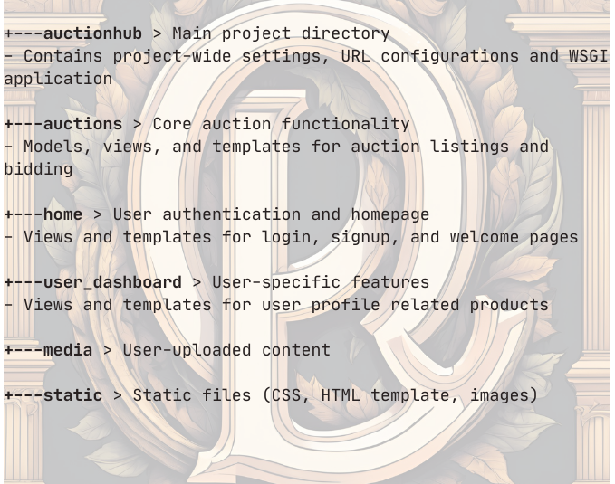

## Installation & Setup

After obtaining the files in repository or cloning the repository(`git clone https://github.com/alper-sayin/Online-Auction-Hub.git`) to desired folder, setting up virtual environment and satisfying the requirements([requirements.txt](requirements.txt)), open the terminal(.venv) in your IDE, you should apply:

- `python manage.py makemigrations auctions` 
- `python manage.py migrate`
- `python manage.py create_test_data`
- And our database is ready with test datas and also users(user0, user1, user2, user3, user4-both passwords are “password” You can see the details in [create_test_data.py](auctions/management/commands/create_test_data.py) and also data details in test_data.json file which automatically created in your project directory after execution
- `python manage.py runserver`
 And then server is ready on http://127.0.0.1:8000 

 ## Usage & Screenshots

Home
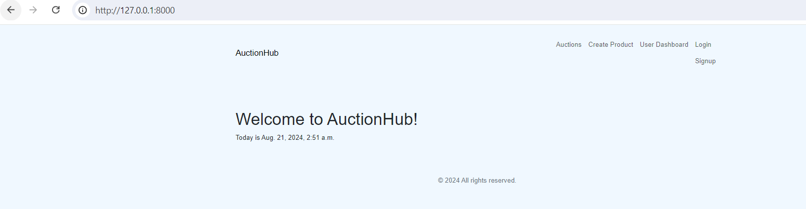

Register for an account or log in if you already have one.

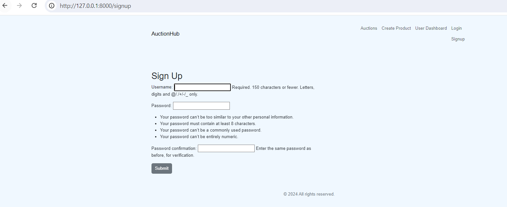

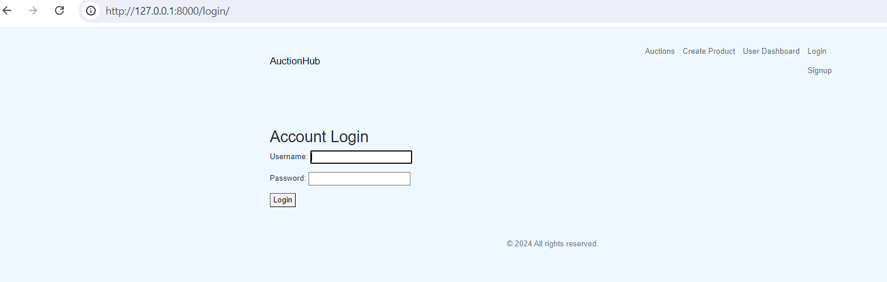

Browse items or use the search functionality to find specific auctions. 

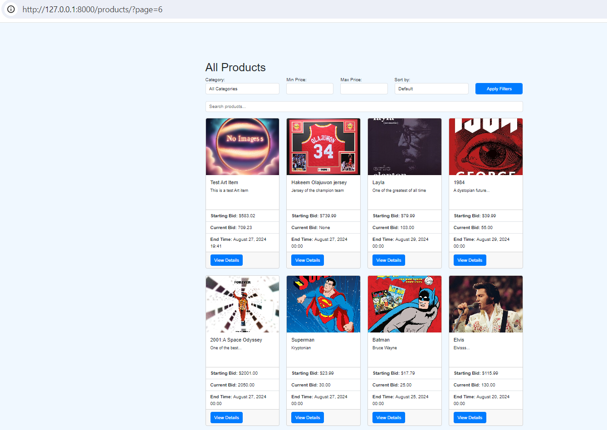
 
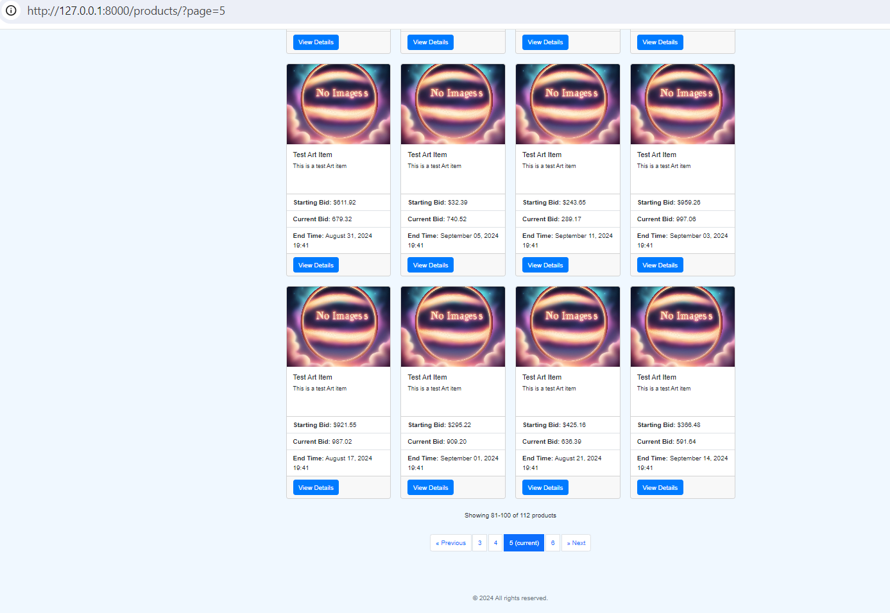

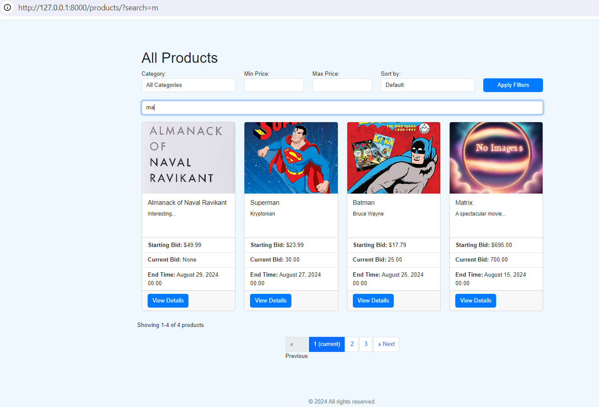

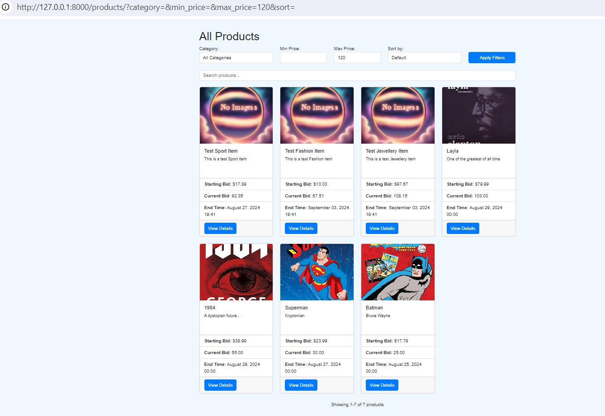

Place bids on items you're interested in. 

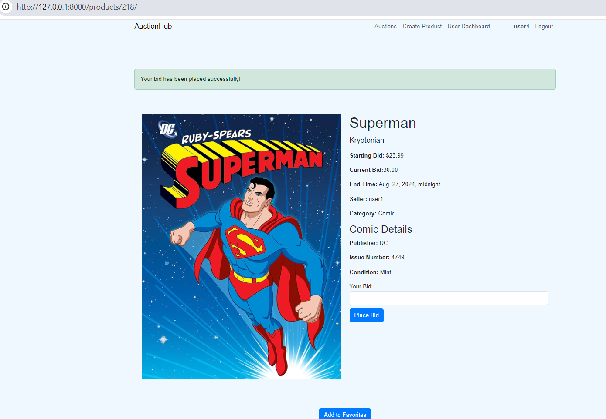

Create your own auction listings to sell items. 

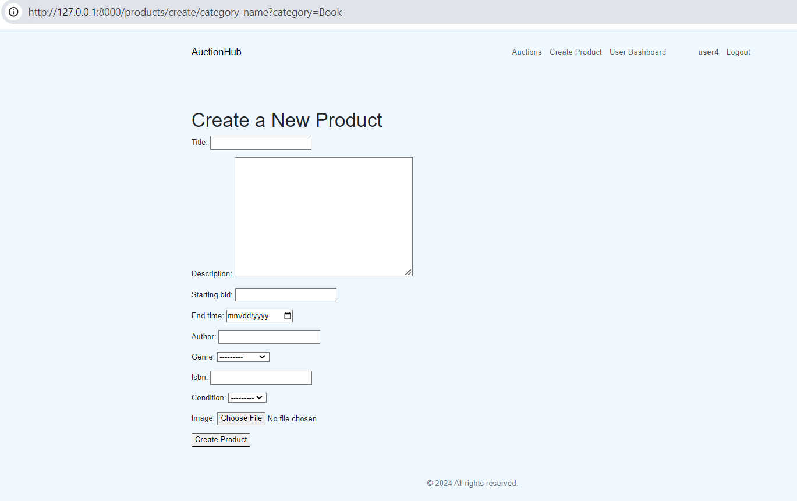

Manage your bids and listings from your user dashboard.

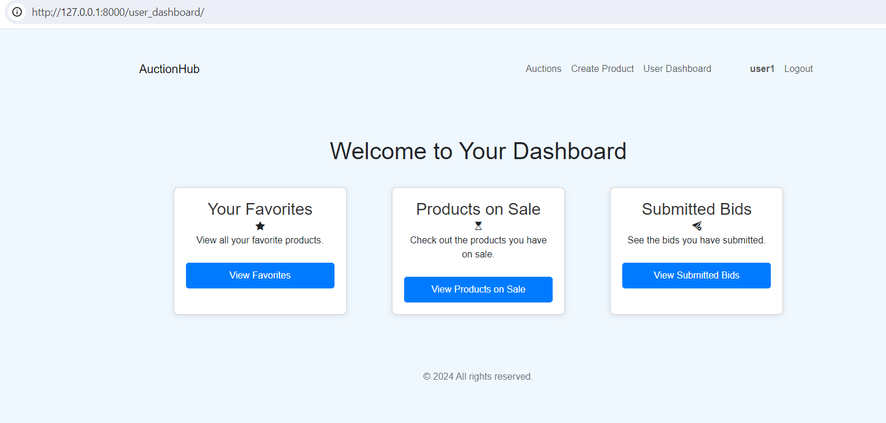

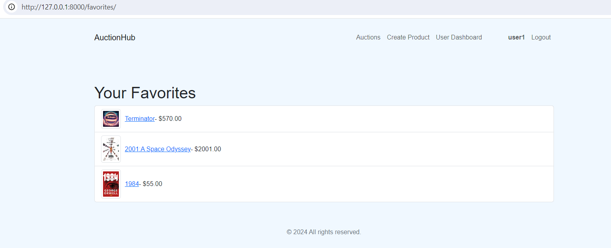

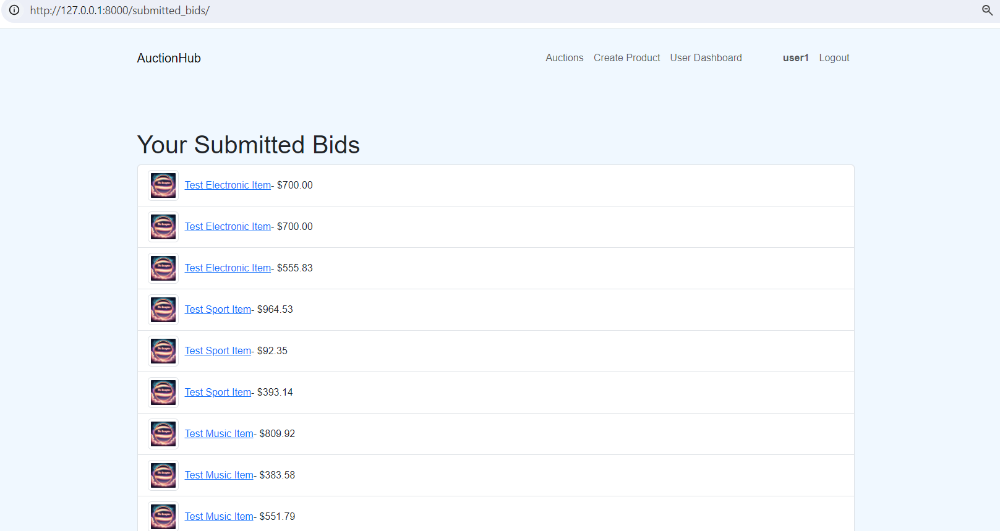

